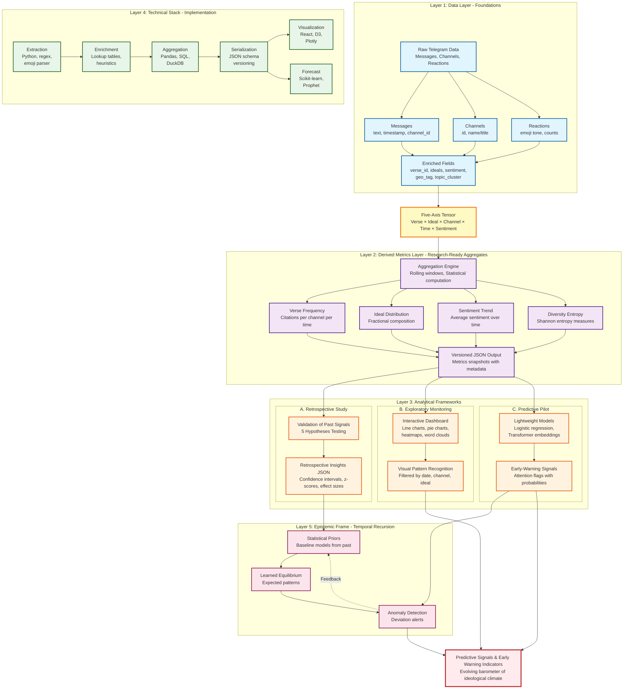

# Analysis Framework Flowchart

This flowchart visualizes the five-layer architecture for Telegram Quranic discourse analysis described in `agents/plans/AGENTS_ROADMAP.md`.

## Legend

### Five Layers

1. **Layer 1 (Blue)** - Data Layer: Raw data collection and enrichment with semantic fields
2. **Layer 2 (Purple)** - Derived Metrics: Statistical aggregations and versioned metrics
3. **Layer 3 (Orange)** - Analytical Frameworks: Three parallel analytical approaches
4. **Layer 4 (Green)** - Technical Stack: Implementation technologies and processing pipeline
5. **Layer 5 (Pink)** - Epistemic Frame: Temporal recursion and self-improving feedback loop

### Key Nodes (25 Total)

**Layer 1 (5 nodes):** Raw Data → Messages → Channels → Reactions → Enriched Fields

**Layer 2 (5 nodes):** Aggregation Engine → Verse Frequency → Ideal Distribution → Sentiment Trend → Entropy → JSON

**Layer 3 (6 nodes):**
- Retrospective: Validation → Insights
- Exploratory: Dashboard → Visual Recognition
- Predictive: Models → Signals

**Layer 4 (6 nodes):** Extraction → Enrichment → Aggregation → Serialization → Visualization → Forecast

**Layer 5 (3 nodes):** Priors → Baseline → Anomaly Detection (with feedback loop)

### Central Organizing Principle

**Five-Axis Tensor (Yellow):** Verse × Ideal × Channel × Time × Sentiment

This tensor serves as the core data structure that connects raw enriched data to all analytical frameworks.

### Final Output (Red)

**Predictive Signals & Early Warning Indicators** - The system becomes an evolving barometer of ideological climate through temporal recursion.

## Flow Summary

1. Raw Telegram data is collected and enriched with semantic, geographic, and temporal metadata
2. Enriched data forms a five-dimensional tensor
3. Statistical aggregations produce versioned metrics
4. Three analytical frameworks process metrics in parallel:
   - Retrospective validation confirms past patterns
   - Exploratory dashboard enables visual monitoring
   - Predictive models generate early-warning signals
5. Technical stack implements the entire pipeline
6. Epistemic frame creates feedback loop: past patterns inform future baselines
7. System outputs actionable intelligence and anomaly alerts
